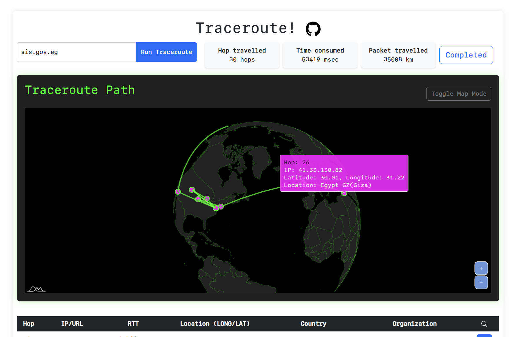
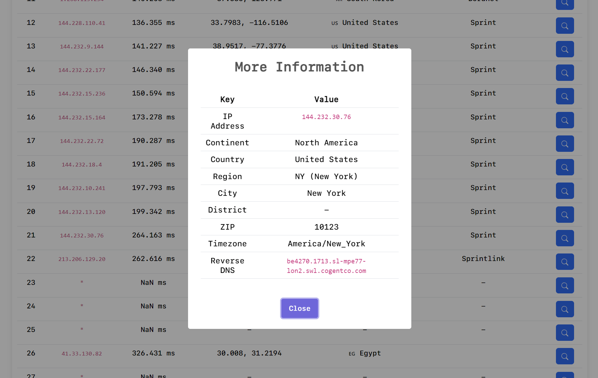

# geotracert


### **Geographically and visually track** `traceroute`(`tracert`) opreation, and get some insight how international Internet network is wired each other. Built with `amChart5`.

### Preview
- Yet simple and intuitive UI
- **Live update** of tracked traceroutes on the interactive global map
- **Live update** of traceroute statistics, and status
- Full log of traceroute hops and detailed information provided by IP-API's OpenAPI.




### Run
- Prepare Python3-installed environment. (Note that this service developed on Windows platform)
- Install required Python3 packages described in `requirements.txt`
```powershell
pip install -r ./requirements.txt
```
- Boot up the FastAPI server. As default, `127.0.0.1:8000` will be the access point.
```powershell
uvicorn main:app --relaod
```

### Why not docker?
It looks like the traceroute operation within Dockerized environment that uses **ICMP(Internet Control Message Protocol)** for outbound traffic isn't technnically supported. Thus, I couldn't dockerize the service and I ask your generosity for this inconvenience.

### Why did you make it?
I was bored, and this idea seemed to be fun, even though I suck at HTML/JS/CSS things.